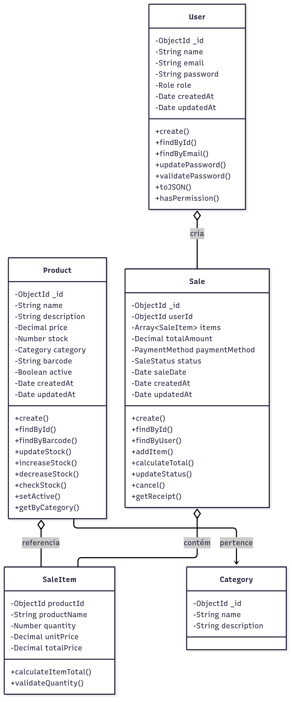

# 🌊 Império Água - Sistema de Controle de Estoque

Sistema completo de controle de estoque desenvolvido com **Node.js** + **Express** (backend), **React** + **Material-UI** (frontend) e **MongoDB** (banco de dados).


## 📋 Sumário

- [🚀 Início Rápido](#-início-rápido)
- [🏗️ Arquitetura](#%EF%B8%8F-arquitetura)
- [✨ Funcionalidades](#-funcionalidades)
- [🛠️ Tecnologias](#%EF%B8%8F-tecnologias)
- [📦 Instalação](#-instalação)
- [🔧 Configuração](#-configuração)
- [🏃‍♂️ Como Executar](#%EF%B8%8F-como-executar)
- [📖 Uso do Sistema](#-uso-do-sistema)
- [🔒 Autenticação](#-autenticação)
- [🌐 API Endpoints](#-api-endpoints)
- [🧪 Testes](#-testes)
- [📁 Estrutura do Projeto](#-estrutura-do-projeto)
- [🤝 Contribuição](#-contribuição)
- [📜 Licença](#-licença)

## 🏗️ Arquitetura

O sistema segue uma arquitetura **client-server** com os seguintes componentes:


<p align="center">
    
    <br/>
</p>

## 🚀 Início Rápido

### Método 1: Script Automático (Recomendado)

```bash
# Clone o repositório
git clone https://github.com/HeitorLouzeiro/imperio_agua_estoque.git
cd imperio_agua_estoque

# Dê permissão de execução e execute o script
chmod +x start.sh
./start.sh
```

### Método 2: Docker Compose Manual

```bash
# Inicie os serviços
docker compose up -d

# Popule o banco com dados de exemplo
./start.sh seed
```

### Método 3: Desenvolvimento Local

```bash
# Instale as dependências
./start.sh setup

# Execute em modo desenvolvimento
./start.sh start dev
```


### Modo Docker (Produção)
```
┌─────────────────┐    ┌─────────────────┐    ┌─────────────────┐
│   Frontend      │    │    Backend      │    │    MongoDB      │
│   (React)       │◄──►│   (Node.js)     │◄──►│   (Database)    │
│   Port: 8080    │    │   Port: 5000    │    │   Port: 27017   │
└─────────────────┘    └─────────────────┘    └─────────────────┘
```

### Modo Desenvolvimento Local
```
┌─────────────────┐    ┌─────────────────┐    ┌─────────────────┐
│   Frontend      │    │    Backend      │    │    MongoDB      │
│   (React)       │◄──►│   (Node.js)     │◄──►│   (Database)    │
│   Port: 3000    │    │   Port: 5000    │    │   Port: 27017   │
└─────────────────┘    └─────────────────┘    └─────────────────┘
```

## ✨ Funcionalidades

### 👥 Gestão de Usuários
- ✅ Cadastro e autenticação de usuários
- ✅ Níveis de acesso (Administrador/Funcionário)
- ✅ Perfil de usuário editável
- ✅ Controle de sessão com JWT

### 📦 Gestão de Produtos
- ✅ CRUD completo de produtos
- ✅ Controle de estoque (quantidade disponível)
- ✅ Categorização por marca
- ✅ Preços e códigos únicos
- ✅ Sistema de busca e filtros
- ✅ Alertas de estoque baixo

### 💰 Gestão de Vendas
- ✅ Registro de vendas
- ✅ Controle de quantidade vendida
- ✅ Histórico de vendas
- ✅ Relatórios e estatísticas
- ✅ Status de vendas (Concluída/Cancelada)

### 📊 Dashboard
- ✅ Visão geral do sistema
- ✅ Gráficos de vendas
- ✅ Produtos mais vendidos
- ✅ Alertas de estoque
- ✅ Métricas em tempo real

## 🛠️ Tecnologias

### Backend
- **Node.js** 18+ - Runtime JavaScript
- **Express.js** - Framework web
- **MongoDB** - Banco de dados NoSQL
- **Mongoose** - ODM para MongoDB
- **JWT** - Autenticação
- **Bcrypt** - Criptografia de senhas
- **Swagger** - Documentação da API
- **Cors** - Cross-Origin Resource Sharing

### Frontend
- **React** 18+ - Biblioteca para UI
- **Material-UI (MUI)** - Componentes visuais
- **React Router** - Roteamento
- **React Hook Form** - Gerenciamento de formulários
- **Recharts** - Gráficos e visualizações
- **Axios** - Cliente HTTP

### DevOps
- **Docker** - Containerização
- **Docker Compose** - Orquestração
- **Nginx** - Servidor web (produção)

## 📦 Instalação

### Pré-requisitos

- **Docker** e **Docker Compose** OU
- **Node.js** 18+ e **MongoDB**

### Verificação de Dependências

```bash
# Verificar Node.js
node --version

# Verificar Docker
docker --version
docker compose version

# Verificar MongoDB (se local)
mongod --version
```

## 🔧 Configuração

### Portas do Sistema

| Serviço | Desenvolvimento | Docker | Descrição |
|---------|----------------|---------|-----------|
| **Frontend** | 3000 | 8080 | Interface do usuário |
| **Backend** | 5000 | 5000 | API REST |
| **MongoDB** | 27017 | 27017 | Banco de dados |
| **Swagger** | 5000/api-docs | 5000/api-docs | Documentação da API |

### Variáveis de Ambiente

#### Backend (.env)
```env
# Banco de dados
MONGO_URI=mongodb://mongo:27017/imperio_agua

# Autenticação
JWT_SECRET=sua_chave_secreta_jwt_super_segura_aqui_123456789

# Servidor
PORT=5000
NODE_ENV=development
```

#### Frontend (.env)
```env
# API
REACT_APP_API_URL=http://localhost:5000/api

# Aplicação
REACT_APP_NAME=Império Água
REACT_APP_VERSION=1.0.0
```

## 🏃‍♂️ Como Executar

### Script de Inicialização

O sistema inclui um script inteligente que detecta automaticamente o melhor modo de execução:

```bash
# Ajuda
./start.sh help

# Inicialização automática
./start.sh

# Força modo Docker
./start.sh start docker

# Força modo desenvolvimento
./start.sh start dev

# Build e inicialização
./start.sh start docker --build

# Status dos serviços
./start.sh status

# Parar serviços
./start.sh stop

# Reiniciar
./start.sh restart

# Popular banco de dados
./start.sh seed

# Ver logs
./start.sh logs [serviço]
```

### Execução Manual

#### Docker Compose
```bash
# Construir imagens
docker compose build

# Iniciar serviços
docker compose up -d

# Ver logs
docker compose logs -f

# Parar serviços
docker compose down
```

#### Desenvolvimento Local
```bash
# Backend
cd backend
npm install
npm start

# Frontend (em outro terminal)
cd frontend
npm install
npm start
```

## 📖 Uso do Sistema

### Acessos

#### Modo Desenvolvimento Local
- **Frontend**: http://localhost:3000
- **API Backend**: http://localhost:5000
- **Documentação Swagger**: http://localhost:5000/api-docs
- **MongoDB**: mongodb://localhost:27017/imperio_agua

#### Modo Docker
- **Frontend**: http://localhost:8080
- **API Backend**: http://localhost:5000
- **Documentação Swagger**: http://localhost:5000/api-docs
- **MongoDB**: mongodb://localhost:27017/imperio_agua (interno do container)

### Credenciais Padrão

Após executar `./start.sh seed`:

```
👤 Administrador
Email: admin@imperioagua.com
Senha: admin123

👤 Funcionário
Email: funcionario@imperioagua.com
Senha: func123
```

## 🔒 Autenticação

O sistema utiliza **JWT (JSON Web Tokens)** para autenticação:

### Níveis de Acesso

| Tipo | Permissões |
|------|-----------|
| **Administrador** | Acesso total ao sistema |
| **Funcionário** | Visualização e vendas apenas |

### Proteção de Rotas

- **Públicas**: Login, documentação
- **Protegidas**: Dashboard, produtos, vendas, usuários
- **Admin**: Gestão de usuários, configurações

## 🌐 API Endpoints

### Autenticação
```http
POST /api/auth/login     # Login
POST /api/auth/register  # Registro
GET  /api/auth/profile   # Perfil do usuário
```

### Usuários
```http
GET    /api/users        # Listar usuários
POST   /api/users        # Criar usuário
GET    /api/users/:id    # Buscar usuário
PUT    /api/users/:id    # Atualizar usuário
DELETE /api/users/:id    # Excluir usuário
```

### Produtos
```http
GET    /api/products     # Listar produtos
POST   /api/products     # Criar produto
GET    /api/products/:id # Buscar produto
PUT    /api/products/:id # Atualizar produto
DELETE /api/products/:id # Excluir produto
```

### Vendas
```http
GET    /api/sales        # Listar vendas
POST   /api/sales        # Criar venda
GET    /api/sales/:id    # Buscar venda
PUT    /api/sales/:id    # Atualizar venda
DELETE /api/sales/:id    # Cancelar venda
```

Para documentação completa, acesse: http://localhost:5000/api-docs


## 📁 Estrutura do Projeto

```
imperio_agua_estoque/
├── 📁 backend/                 # API Node.js
│   ├── 📁 controllers/         # Controladores
│   ├── 📁 models/             # Modelos do banco
│   ├── 📁 routes/             # Rotas da API
│   ├── 📁 middlewares/        # Middlewares
│   ├── 📄 index.js            # Servidor principal
│   └── 📄 package.json
├── 📁 frontend/               # Interface React
│   ├── 📁 src/
│   │   ├── 📁 components/     # Componentes reutilizáveis
│   │   ├── 📁 pages/          # Páginas da aplicação
│   │   ├── 📁 hooks/          # Custom hooks
│   │   ├── 📁 services/       # Serviços (API)
│   │   ├── 📁 contexts/       # Contextos React
│   │   └── 📁 utils/          # Utilitários
│   └── 📄 package.json
├── 📄 docker-compose.yml      # Orquestração Docker
├── 📄 start.sh               # Script de inicialização
└── 📄 README.md              # Este arquivo
```

## 👥 Colaboradores

<table>
  <tr>
    <td align="center">
      <a href="https://github.com/HeitorLouzeiro">
        
        <br />
        <sub><b>Heitor Louzeiro</b></sub>
      </a>
      <br />
      <sub>💻 Desenvolvedor</sub>
      <br />
      <a href="https://www.linkedin.com/in/heitor-louzeiro/">
        
      </a>
    </td>
    <td align="center">
      <a href="https://github.com/LivramentoAmaral">
        
        <br />
        <sub><b>Marcos Amaral</b></sub>
      </a>
      <br />
      <sub>💻 Desenvolvedor</sub>
      <br />
      <a href="https://www.linkedin.com/in/marcos-do-livramento-amaral-90b941224/">
        
      </a>
    </td>
  </tr>
</table>

## 🤝 Contribuição

1. **Fork** o projeto
2. Crie uma **branch** para sua feature (`git checkout -b feature/AmazingFeature`)
3. **Commit** suas mudanças (`git commit -m 'Add some AmazingFeature'`)
4. **Push** para a branch (`git push origin feature/AmazingFeature`)
5. Abra um **Pull Request**

### Diretrizes de Contribuição

- ✅ Siga os padrões de código existentes
- ✅ Adicione testes para novas funcionalidades
- ✅ Atualize a documentação quando necessário
- ✅ Use commits semânticos

## 📜 Licença

Este projeto está licenciado sob a Licença MIT - veja o arquivo [LICENSE](LICENSE) para detalhes.

---

<div align="center">

**Desenvolvido com ❤️ por:**

<table>
  <tr>
    <td align="center">
      <strong>Heitor Louzeiro</strong><br/>
      <a href="https://github.com/HeitorLouzeiro">
        
      </a>
      <a href="https://www.linkedin.com/in/heitor-louzeiro/">
        
      </a>
    </td>
    <td align="center">
      <strong>Marcos Amaral</strong><br/>
      <a href="https://github.com/LivramentoAmaral">
        
      </a>
      <a href="https://www.linkedin.com/in/marcos-do-livramento-amaral-90b941224/">
        
      </a>
    </td>
  </tr>
</table>

🌊 **Império Água - Controle Total do seu Estoque** 🌊

</div>